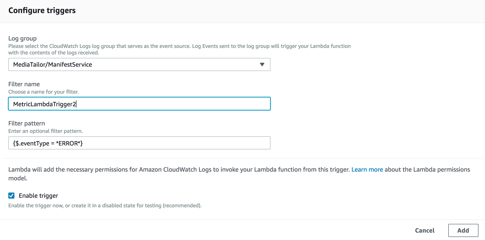
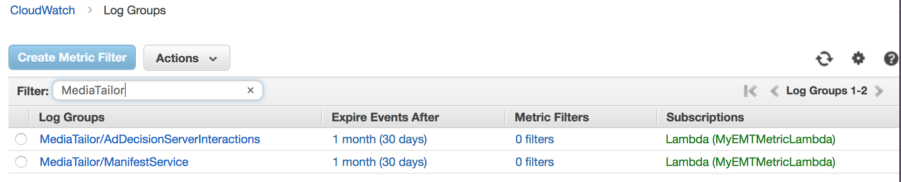
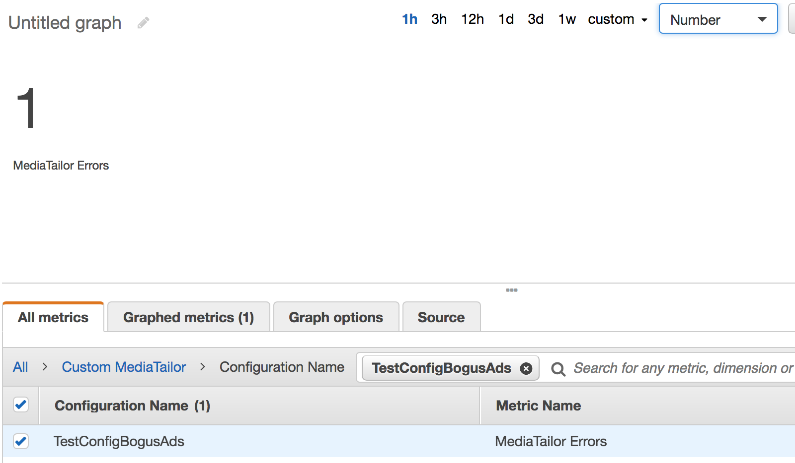
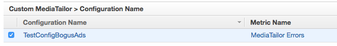
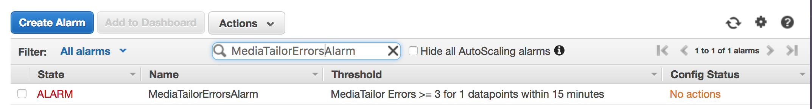

# Creating a Custom AWS Elemental MediaTailor Metric and CloudWatch Alarm

This tutorial will take you through creating a custom metric using the AWS Elemental MediaTailor log groups that have been made available in CloudWatch. There are currently two AWS Elemental MediaTailor log groups. One keeps track of Manifest related errors and another records Ad Server and AWS Elemental MediaTailor errors.  In this exercise, we create a new Amazon CloudWatch metric that tallies a count each time an error is recorded, regardless of which log group the error is written to. We will then create an Amazon CloudWatch alarm that gets triggered whenever a threshold of errors is reached in a given amount of time. This entire tutorial will be done in the **us-east-1**  region.  

Here are the high level steps we will walk through to accomplish our task above:
1. [Create an IAM role that gives AWS Elemental MediaTailor access Amazon CloudWatch](#create-an-iam-role-that-gives-aws-elemental-mediatailor-access-amazon-cloudwatch)
1. [Create an IAM role that the AWS Lambda will need to execute](#create-an-iam-role-that-the-aws-lambda-will-need-to-execute)
1. [Using an AWS Lambda, create/update a custom metric that will add a count every time a MediaTailor related error occurs](#create-update-a-custom-metric-using-aws-lambda)
1. [Subscribe the AWS Lambda to the AWS Elemental MediaTailor log groups](#subscribe-the-aws-lambda-to-the-aws-elemental-mediatailor-log-groups)
1. [Test the custom metric](#test-the-custom-metric)
1. [Create an Amazon CloudWatch alarm based on the metric created](#create-an-amazon-cloudwatch-alarm-based-on-the-metric-created)

# Requirements/Assumptions
1. You have an AWS account. 
1. You have some familiarity with AWS IAM, Lambda and CloudWatch.
1. The entire tutorial will be done in **us-east-1** region.

## Create an IAM role that gives AWS Elemental MediaTailor access Amazon CloudWatch
You will need to explicitly give AWS Elemental MediaTailor access to write logs to Amazon CloudWatch. Detailed instructions on how to do that can be found in [this Amazon IAM documentation](https://docs.aws.amazon.com/mediatailor/latest/ug/monitoring-permissions.html).
Without doing this step, AWS Elemental MediaTailor won't be able to create and write logs.

## Create an IAM role that the AWS Lambda will need to execute 
We will now create a role that the Lambda we're going to write can assume, in order to write metric data into AWS CloudWatch.

1. Navigate to the AWS IAM console.
1. Select **Roles**.
1. Create on **Create Role**.
1. Click on **Lambda**.
1. Click **Next**.
1. In the **Search text box**, type **AWSLambdaFullAccess**. Check the box next to the Policy with the same name to select it.
1. Click **Next: Review**.
1. Type **MetricLambdaRole** in the Role name. 
1. Click on **Create role**.

## Create/update a custom metric using AWS Lambda
This Lambda will create the metric we're going to call **MediaTailor Errors**. It will be created in a custom namespace (AWS Elemental MediaTailor normally writes in the AWS/MediaTailor namespace) we'll call **Custom MediaTailor**. The metric is created for every AWS Elemental MediaTailor configuration name. Each time an error is logged in either of the AWS Elemental MediaTailor log groups, this lambda will get triggered and add to the count of the custom metric. 

1. Navigate to the AWS Lambda console.
1. Click on **Create Function**.
1. Enter **MyEMTMetricLambda** for the function name.
1. Select **Python 3.6** for Runtime.
1. Under **Existing Role**, look for and select the IAM Role you created in previous section.
1. Edit the `lambda_function.py` code and paste the code below:

```
import boto3
import base64
import gzip
import json
import os

def lambda_handler(event, context):
    cw_client = boto3.client('cloudwatch')
    metric_name = "MediaTailor Errors"
    namespace = "Custom MediaTailor"

    data = gzip.decompress(base64.b64decode(event['awslogs']['data']))
    decoded_data = json.loads(data.decode())
    for logevent in decoded_data['logEvents']:
        ads_log = json.loads(logevent['message'])
        event_type = ads_log['eventType']
        config_name = ads_log['originId']
        print ("Event type: %s Config Name: %s" % (event_type, config_name))
        emit_metric(cw_client, metric_name, namespace, config_name)
    return

def emit_metric(cw_client, metric_name, namespace, config_name):
    print ("adding count to metric %s in namespace %s" % (metric_name, namespace))
    dimension_name = "Configuration Name"
    cw_client.put_metric_data(
        Namespace = namespace,
        MetricData = [
            {
                'MetricName': metric_name,
                'Dimensions': [
                    {
                        'Name' : dimension_name,
                        'Value' : config_name
                    },
                ],
                "Value": 1,
                "Unit": "Count"
            }
        ]
    )

```
1. Hit the Save button.

## Subscribe the AWS Lambda to the AWS Elemental MediaTailor log groups
In order for the Lambda we previously created to be triggered, we will need to subscribe it to the two AWS Elemental MediaTailor log groups. However, we only want it to be triggered whenever errors are logged, and not any other time. We accomplish this by adding a specific Filter Pattern matching error event types to the subscription.

1. Still on the AWS Lambda console, scroll back to the top and add a trigger to the Lambda we just created. Click on **CloudWatch Logs**.
1. Scroll down to the **Configure Triggers** section.
1. Under the **Log Group** dropdown, select **MediaTailor/AdDecisionServerInteractions**.
1. Enter **MetricLambdaTrigger1** for **Filter Name**.
1. To limit the trigger to only occur when errors appear in this particular Log Group, enter **{$.eventType = *ERROR*}** for the **Filter Pattern**.
1. Hit the Add button.
1. Hit the Save button.
1. Scroll back to the top of the Lambda console and add another trigger to the Lambda. Click on **CloudWatch Logs**.
1. Scroll down to the **Configure Triggers** section.
1. Under the **Log Group** dropdown, select **MediaTailor/ManifestService**.
1. Enter **MetricLambdaTrigger2** for **Filter Name**.
1. To limit the trigger to only occur when errors appear in this particular Log Group, enter **{$.eventType = *ERROR*}** for the **Filter Pattern**.

1. Hit the **Add** button.
1. Hit the **Save** button.

1. Verify that the Lambda is subscribed to the two Log Groups by navigating over the the AWS CloudWatch console, then click on **Logs**.
1. In the Filter box, type **MediaTailor** and hit enter. This should bring up the two log groups and show the Lambda you created under **Subscriptions**.


## Test the custom metric
To ensure that the custom metric actually gets created and updated by our Lambda, we will create an AWS Elemental MediaTailor configuration that will generate an error when we try to view its playback endpoint. To do this, we will provide it with a bogus Ad Decision Server that is unreachable. For the Video Content Source, we will be using a pre-generated AWS Elemental MediaPackage origin endpoint with ad markers. During playback of AWS Elemental MediaTailor's generated HLS endpoint, an error will be generated in the MediaTailor/AdDecisionServerInteractions log group. This will in turn, trigger the Lambda we created, which will then create/update the metric in the **Custom MediaTailor** namespace in AWS CloudWatch.

1. Navigate to the AWS Elemental MediaTailor console.
1. Create a new configuration.
1. Enter **TestConfigBogusAds** for **Configuration Name**.
1. Enter **https://cf98fa7b2ee4450e.mediapackage.us-east-1.amazonaws.com/out/v1/6477e4bc4bd84cbb895808281b1942b2** for **Video content source**.
1. Enter **https://bogusads.net** for **Ad Decision Server**.
1. On a browser, navigate to the [VideoJS open source HLS player](https://videojs.github.io/videojs-contrib-hls/).
1. In the **Video URL** text box, enter the **HLS playback prefix** generated by AWS Elemental MediaTailor, concatenated with **index.m3u8** (this is the stream name of the pre-generated origin endpoint). You'll end up with complete URL like so: **https://7a87b292c71a4fb4b0218f6d270338c9.mediatailor.us-east-1.amazonaws.com/v1/master/cf6421621b389b384c1fd22e51603ee95db76ae0/TestConfigBogusAds/index.m3u8**
1. Hit the Play button to start playback. Let it run long enough until it hits an ad slate. AWS Elemental MediaTailor will attempt to talk to the Ad Decision Server at this point and fail.
1. Navigate over to the AWS CloudWatch console.
1. Click on **Metrics**.
1. Click on **Custom MediaTailor**. You should see the AWS Elemental MediaTailor configuration (**TestConfigBogusAds**) we previously created under Configuration Name. Metric Name should show **MediaTailor Errors** which is the metric name we gave it in the Lambda.
1. Select the Configuration Name and click on the **Graphed Metrics** tab.
1. Change the **Statistic** to **Sum** and update the **Period** to 15 minutes.
1. At the top of the graph, change the graph type dropdown from **Line** to **Number**. You should see the number of times an error has been recoded in this particular metric (you might only see 1). 
1. Let your playback run long enough to generate at least 3 errors in the metric.



## Create an Amazon CloudWatch alarm based on the metric created
The Amazon CloudWatch alarm we're going to create here will get triggered whenever 3 or more errors get recorded by our custom metric, in a 15 minute period. The threshold is arbitrary and can be adjusted to reflect a specific business need.

1. Still on the AWS CloudWatch console, cick on **Alarms** on the left side navigation. 
1. Click on the **Create Alarm** button.
1. In the **Search Metrics** search box, type in our AWS Elemental MediaTailor Configuration name **TestConfigBogusAds**.
1. Under **Custom MediaTailor > Configuration Name**, select our configuration name.

1. Click **Next**.
1. Enter **MediaTailorErrorsAlarm** for the **Name**.
1. Enter **Alarm will trigger when 3 or more errors seen in the last 15 minutes** for the **Description**.
1. Set **Whenever MediaTailor Errors is >=** to 3.
1. On the right hand side, under **Alarm Preview**, set **Period** to **15 minutes**. 
1. Statistics should be set to **Standard** and **Sum**.
1. Under **Actions**, delete the default Notification. We will not be setting notifications for this exercise. 
1. Click the **Create Alarm** button.
1. Back at the CloudWatch Alarms page, type **MediaTailorErrorsAlarm** in the **Search Alarm** search box and hit Enter. This should return the Alarm we just created in an Alarm state.


# AWS CloudFormation
This tutorial has been automated. An AWS CloudFormation template has been provided that will create the Lambda, IAM role needed by Lambda, subscription to Lambda, and the CloudWatch alarm. The template will **not** create the IAM role that give AWS Elemental MediaTailor access to CloudWatch (the first section in this tutorial). It assumes this step has previously been done.

The template is available in the **us-east-1** region only. Copy of template and python codes can be found [here](CloudFormation).

Launch stack by clicking [here](https://console.aws.amazon.com/cloudformation/home?region=us-east-1#/stacks/new?stackName=MediaTailorCustomMetrics&templateURL=https://s3.amazonaws.com/rodeolabz-us-east-1/mediatailor/EMTMetrics.json).