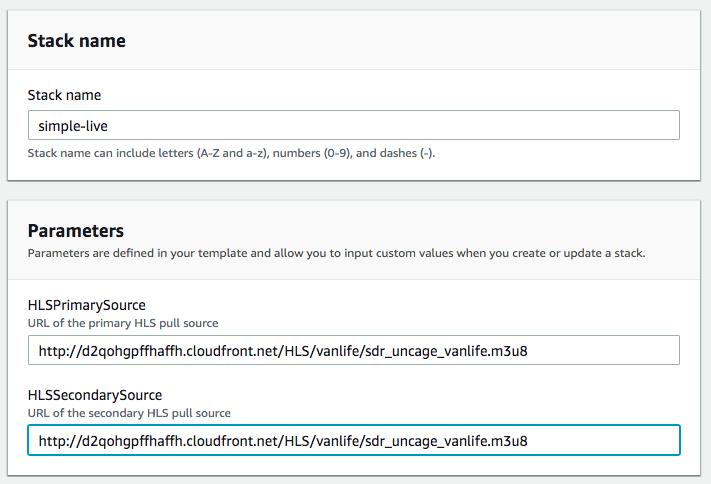
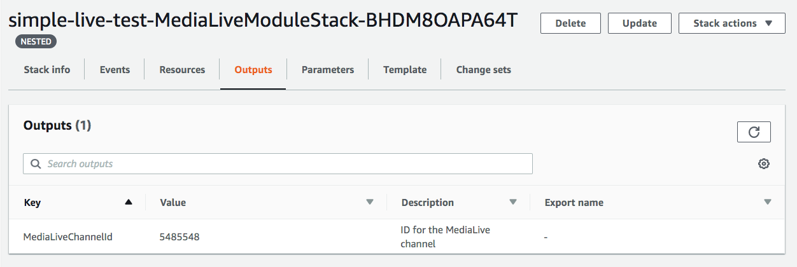
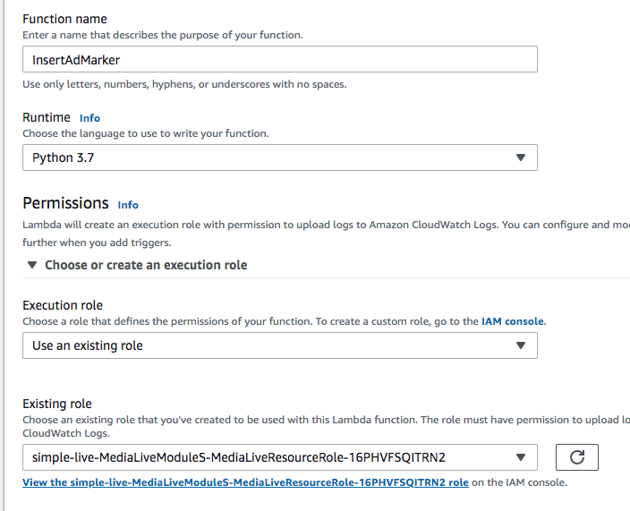
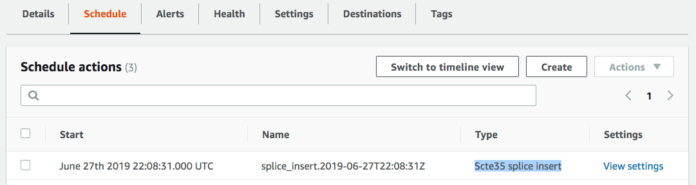
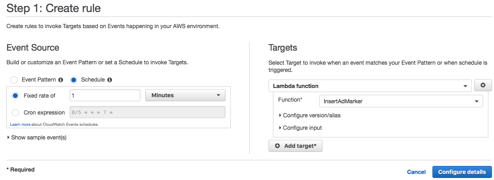
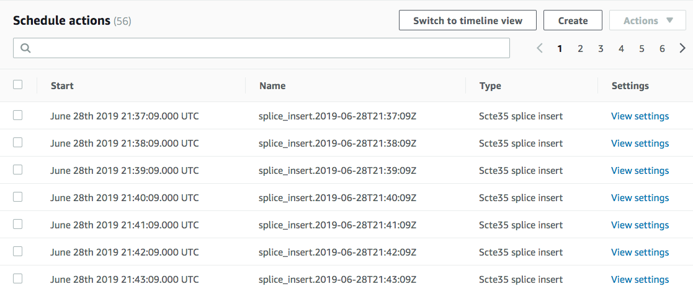

# Inserting Ad Markers with AWS Elemental MediaLive

This module will show you how to insert ad markers into a MediaLive stream. This stream will be pushed to the AWS Elemental MediaPackage origin for HLS packaging. We will then in turn use MediaPackage's HLS endpoint as a video source to MediaTailor for monetization.
	
## Implementation Instructions

### 1. Deploy the simple live workshop CloudFormation template
This step will create the necessary MediaLive and MediaPackage channels. 

**Step-by-step instructions**

1. From your browser, navigate to the [aws-media-services-simple-live-workflow page](https://github.com/aws-samples/aws-media-services-simple-live-workflow/tree/master/CloudFormation). 

1. Copy the [CloudFormation link](https://s3-us-west-2.amazonaws.com/rodeolabz-us-west-2/cloudformation/LiveStreamingWorkshopResources.json) to launch the entire workflow.

1. From the AWS console, go to CloudFormation. Click on **Create stack** button.

1. Under **Amazon S3 URL**, paste the CloudFormation link into the textbox. Click **Next**.

1. Provide a stack name like `simple-live`.

1. The default input currently has ad markers. We want to use a source that doesn't have ad markers yet. Replace **HLSPrimarySource** and **SecondaryPrimarySource** with:
	`http://d2qohgpffhaffh.cloudfront.net/HLS/vanlife/sdr_uncage_vanlife.m3u8`

	

1. Click **Next** twice.

1. Under **Capabilities**, check both boxes to acknowledge the required resources. Then click on the **Create Stack** button.

1. Once stack is fully deployed, click on the `simple-live-MediaLiveModuleStack-[random-string]` nested stack. Under **Outputs**, note the **MediaLiveChannelId** value. You will need this later. 

	

### 2. Create and test the Lambda that will insert ad markers to MediaLive

**Step-by-step instructions**

1. From the AWS console, go to Lambda.

1. Click on **Create function** button.

1. Provide a function name like `InsertAdMarker`.

1. Choose `Python 3.7` for your runtime.

1. For the execution role, choose `Use an existing role`. In the existing role dropdown, choose the role that the CloudFormation created for you named `simple-live-MediaLiveModuleS-MediaLiveResourceRole-[random-string]`.

	

1. Replace the code in lambda_function.py with the following: 
	```
	import datetime
	import boto3
	import json

	def lambda_handler(event, context):
		print (json.dumps(event))
		offset = 20 #in seconds 
		channel = "8523202" #replace with your MediaLive channel ID
		event_id = 1001 #id of your choice
		duration = 900000 #duration of ad (10 sec* 90000 Hz ticks)
		medialive = boto3.client('medialive')

		now = datetime.datetime.utcnow()
		#print("Current UTS Time:", now)
		action = splice_insert(now, int(offset), int(event_id), int(duration))
		try:
			response = medialive.batch_update_schedule(ChannelId=channel, Creates={'ScheduleActions':[action]})
			print("medialive schedule response: ")
			print(json.dumps(response))
		except Exception as e:
			print("Error creating Schedule Action")
			print(e)
		return response
	
		# start_time = when to insert our ad
		# offset = added to start_time to determine actual time of ad marker insertion; 
		#           if offset is too soon, actual time to insert marker may have already passed 
		#           by the time MediaLive receives the scheduled action and will fail
		# event_id = splice event ID as defined in SCTE-35
		# duration = length of ad
		def splice_insert(start_time, offset, event_id, duration):
			actual_start_time = start_time + datetime.timedelta(seconds=offset)
			actual_start_time_str = actual_start_time.strftime('%Y-%m-%dT%H:%M:%SZ')
			action={
				'ActionName': 'splice_insert.{}'.format(actual_start_time_str), #actionName must be unique so we append the time string
				'ScheduleActionSettings': {
					'Scte35SpliceInsertSettings': {
						'SpliceEventId': event_id,
						'Duration': duration
					}
				},
				'ScheduleActionStartSettings': { 
					'FixedModeScheduleActionStartSettings': { 
						'Time': actual_start_time_str 
					}
				}    
			}
			return action
	```
1. Make sure to replace the **channel** value with your own MediaLive channel ID. Save the Lambda.
1. Let's test this Lambda by clicking on the **Test** button.
1. Give the test a name like `SimpleTest` and hit the **Save** button.
1. Select the test you just created and saved and click the **Test** button.
1. If there were no errors, then the ad marker we scheduled for insertion should have made it to MediaLive. 
1. On the AWS console, navigate to MediaLive. Select the channel that was created by your stack earlier. Under schedule, you should see an item with type `Scte35 splice insert`. Click on the **View Settings** link to inspect the details of the scheduled action. It should reflect all the settings that was defined in the Lambda that you created earlier.

	

### 3. Trigger Lambda via CloudWatch scheduled events
Now that the Lambda has been defined, let's schedule it to get triggered at a regular interval, say every 60 seconds so that we can easily test this with MediaTailor later. 

1. From the AWS console, navigate to CloudWatch.

1. Under **Events**, click on **Rules**.  Click on **Create Rule** button.

1. Under **Event Source**, choose **Schedule**. 

1. In **Fixed rate of**, edit to say `1 minute`.

1. Under **Targets**, click on **Add Target**.

1. In the **Function** dropdown, select your `InsertAdMarker` function.

	

1. Click on **Configure details** button. 

1. Provide a name like `InsertAdMarkerEveryMinute`. Make sure to leave the **State** to `Enabled`. Otherwise, this rule will not run. Click on **Create Rule** button.

1. With the event enabled, you should see a scheduled `Scte35 splice insert` in the MediaLive channel's Schedule every minute.

	

### 4. Monetize your workflow
Now that ad markers are making their way into our stream, it's time to add MediaTailor to the workflow. 

1. Follow the [instructions here](https://github.com/aws-samples/aws-media-services-simple-live-workflow/tree/master/5-MediaTailor) on setting up your MediaTailor configuration.  

1. In section 1, step 5, use the VAST tag from DFP for your ADS:
`https://pubads.g.doubleclick.net/gampad/ads?sz=640x480&iu=/124319096/external/single_ad_samples&ciu_szs=300x250&impl=s&gdfp_req=1&env=vp&output=vast&unviewed_position_start=1&cust_params=deployment%3Ddevsite%26sample_ct%3Dlinear&correlator=[avail.random]`

1. For testing purposes only, you may skip step 3 (Integrating with Amazon CloudFront). During playback testing, you should see an ad for 10 seconds every minute.


## Completion

Congratulations! You've successfully created a MediaLive stream with ad markers being inserted at a regular interval. In addition, you have monetized your stream using MediaTailor.


## Cloud Resource Clean Up

### CloudFormation
Select and delete the Live Streaming and SPEKE CloudFormation templates deployed as part of the prerequisites. This will clean up all the resources created by the two templates. 

### AWS Elemental MediaTailor
Select the configuration you created and hit the **Delete** button to remove the configuration.
