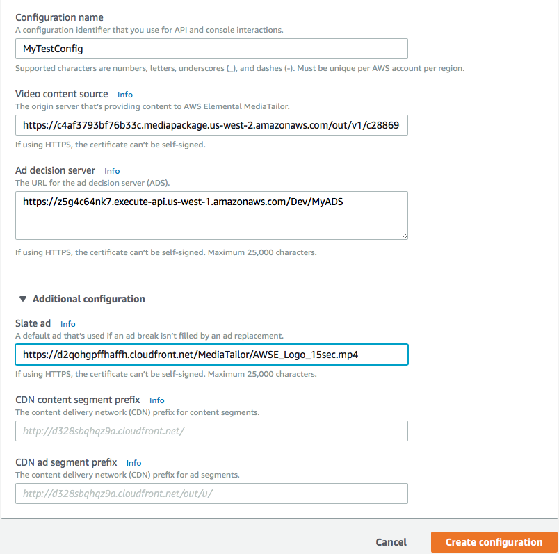
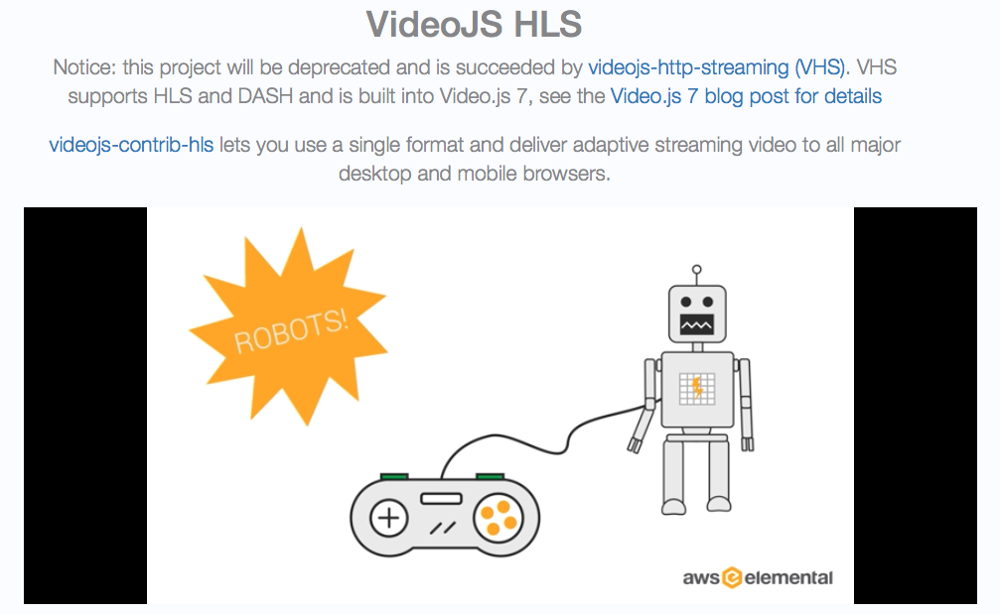
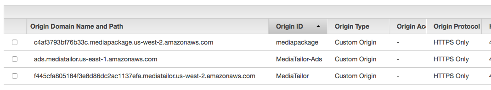
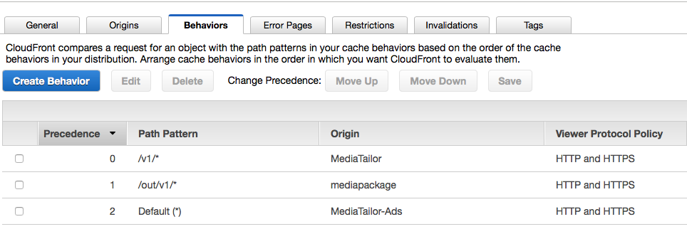
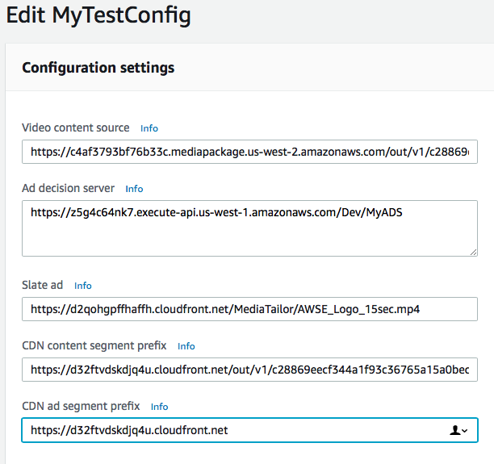

# Monetizing an Encrypted Live Stream with AWS Elemental MediaTailor
This module will take you through creating a Mediatailor configuration using previously created AWS Elemental MediaLive and AWS Elemental MediaPackage channels. The MediaPackage channel will have been encrypted using a SPEKE reference server.
	

## Prerequisites
This module relies on the completion of the following previous modules:
* Launch and deploy the [Live Streaming on AWS Solution CloudFormation template](https://console.aws.amazon.com/cloudformation/home?region=us-east-1#/stacks/new?stackName=LiveStreaming&templateURL=https:%2F%2Fs3.amazonaws.com%2Fsolutions-reference%2Flive-streaming-on-aws%2Flatest%2Flive-streaming-on-aws.template) - Sets up MediaLive and MediaPackage and CloudFront. Make sure to **start your MediaLive channel** once the template has been fully deployed.
* Launch and deploy the [SPEKE reference server](https://console.aws.amazon.com/cloudformation/home?region=us-east-1#/stacks/new?stackName=reinvent-live-speke&templateURL=https://s3.amazonaws.com/rodeolabz-us-east-1/speke/speke_reference.json) CloudFormation template,  then follow the instructions on [encrypting your MediaPackage HLS channel](https://github.com/awslabs/speke-reference-server/blob/master/workflow/drm-live.md).

You will also need an Ad decision server (ADS). For this workshop, we will use a previously deployed [simple, serverless mock ADS](../MockADS). 

## Implementation Instructions

### 1. Create an AWS Elemental MediaTailor Configuration 

**Step-by-step instructions**

1. From the AWS Management Console, choose **Services** then select **AWS Elemental MediaTailor**. 

1. Click on **Create configuration**.

1. Enter `MyTestConfig` for the **Configuration  Name**.

1. For the **Video content source**, enter the encrypted MediaPackage HLS Endpoint URL, but  **_without the manifest filename_** . 
	
	If your MediaPackage endpoint is:

	https://547f72e6652371c3.mediapackage.us-west-2.amazonaws.com/out/v1/85ae554d000d48cab55aab1ae3df9071/index.m3u8
	
	Then your content source is:
	
	https://547f72e6652371c3.mediapackage.us-west-2.amazonaws.com/out/v1/85ae554d000d48cab55aab1ae3df9071

1. Enter `https://d2v7jbplksd24.cloudfront.net/Dev/MyADS` for the **Ad decision server**. 

1. Expand the **Additional configuration** section. Enter `https://d2qohgpffhaffh.cloudfront.net/MediaTailor/AWSE_Logo_15sec.mp4` for the **Slate ad**.

	

1. Click **Create Configuration**. 

1. Click on **MyTestConfig**. Under **Playback endpoints**, note down the **HLS playback prefix** as you'll need it in the next section.

### 2. Test MediaTailor Playback 

1. Construct the playback URL that you will need to play back your video. This will consist of the **HLS playback prefix** (eg. _https://f445cfa805184f3e8d86dc2ac1137efa.mediatailor.us-west-2.amazonaws.com/v1/master/cf6421621b389b384c1fd22e51603ee95db76ae0/MyTestConfig/_)
concatenated with the **manifest filename of your MediaPackage playback endpoint** (eg. _index.m3u8_) 

	Sample full playback URL:    _https://f445cfa805184f3e8d86dc2ac1137efa.mediatailor.us-west-2.amazonaws.com/v1/master/cf6421621b389b384c1fd22e51603ee95db76ae0/MyTestConfig/index.m3u8_

1. On a browser, navigate to [VideoJS's HLS demo player page](https://videojs.github.io/videojs-contrib-hls/).

1. In the **Video URL** testbox, enter the playback URL constructed above and hit Load. If your player doesn't start automatically, hit the Play button. You should see the main content of your video play for the first 60 seconds, followed by ads for 45 seconds, and then back to video content. **Note:** You may not see ads the first time you play back if ads are not ready and are still being transcoded. 

	

`CHECKPOINT!` Make sure that playback is working before proceeding to the next section. Integrating with CloudFront will only work if initial playback is successful.

### 3. Integrate with Amazon CloudFront

**Step-by-step instructions**

#### 3a. Add Origins to the CloudFront Distribution 

1. From the AWS Management Console, choose **Services** then select **CloudFront**.

1. Select the distribution created by the template ran at the beginning of the workshop. 

1. Click on the **Origins** tab, and click on the **Create Origin** button. 

1. Enter MediaTailor's hostname for the **Origin Domain Name**. This will come from the **HLS playback prefix** of MediaTailor (e.g. _f445cfa805184f3e8d86dc2ac1137efa.mediatailor.us-west-2.amazonaws.com_)

1. Leave the **Origin Path** blank.

1. Update the **Origin ID** to `MediaTailor`.

1. Update the **Origin Protocol Policy** to **HTTPS**. 

1. Click **Create**. 

1. Go back to the **Origins** tab, and click on the **Create Origin** button. 

1. Enter MediaTailor's ad server hostname for the **Origin Domain Name**. Since we're in us-west-2, this will be:
`ads.mediatailor.us-west-2.amazonaws.com`

1. Leave the **Origin Path** blank.

1. Update the Origin ID to `MediaTailor-Ads`.

1. Update the **Origin Protocol Policy** to **HTTPS**.  

1. Click on **Create**.

	

#### 3b. Add Cache Behaviors to Your Distribution

1. Click on the **Behaviors** tab and click on the **Create Behavior** button.

1. Select the **Default** behavior, and click on the **Edit** button.

1. Update the **Origin** and select the `MediaTailor-Ads` origin.

1. Set **Cache Based on Selected Request Headers** to `None (Improves caching)`.

1. Click on **Yes, Edit**.

1. Click the **Create** button to add another cache behavior. 

1. Enter `/v1/*` for the **Path Pattern**.  

1. Under **Origin**, select the `MediaTailor` origin.

1. For **Query String Forwarding and Caching**, select **Forward all, cache based on all**. 

1. Click on **Create**.

1. Click the **Create** button to add another cache behavior. 

1. Enter `/out/v1/*` for the **Path Pattern**.  

1. Under **Origin**, select the `mediapackage` origin.

1. For **Query String Forwarding and Caching**, select **Forward all, cache based on all**. 

1. Click on **Create**.

1. Under the **Behaviors** tab, double-check the precedence of the caching behavior as this matters. Your primary precedence should be the MediaTailor origin (precedence 0), followed by the MediaPackage origin (precedence 1), and lastly by the ads origin (which is at Precedence 2 and is the Default). If this is not the precedence reflected, select one of the Behaviors and **Change Precedence** by clicking on either the **Move Up** or **Move Down** button, to make the adjustment. 

	**NOTE:** When you make changes to the CloudFront distribution, it will go into *In Progress* state. Once it's back to the *Deployed state*, your changes will have taken effect.

	

## Update MediaTailor Configuration with CloudFront Details

1. From the AWS Management Console, choose **Services** then select **AWS Elemental MediaTailor**.

1. Click on the Configuration (`MyTestConfig`) you created in section 1 and hit the **Edit** button.

1. For the **CDN content segment prefix**, construct your URL by putting together the protocol(https), the CloudFront **Domain Name**, and the path of the MediaPackage endpoint URL. For example: _https://**d32ftvdskdjq4u.cloudfront.net**/out/v1/85ae554d000d48cab55aab1ae3df9071_

1. For the **CDN ad segment prefix**, construct your URL by putting together the protocol, and the CloudFront  **Domain Name**. For example: _https://d32ftvdskdjq4u.cloudfront.net_

1. Click **Save**.

	

## Test MediaTailor Playback with CloudFront

1. Once your CloudFront distribution is in the **Deployed** status, and **Enabled** state, try playing back your stream using the same demo player. Take your playback URL from Section 2, Step 2 and replace the MediaTailor hostname with the CloudFront **Domain Name** that was assigned to your distribution. 

	For example, if your MediaTailor playback URL is: _https://**f445cfa805184f3e8d86dc2ac1137efa.mediatailor.us-west-2.amazonaws.com**/v1/master/cf6421621b389b384c1fd22e51603ee95db76ae0/MyTestConfig/index.m3u8_

	then your CloudFront playback URL is:
	_https://**d32ftvdskdjq4u.cloudfront.net**/v1/master/cf6421621b389b384c1fd22e51603ee95db76ae0/MyTestConfig/index.m3u8_

1. Video should play back as before the CloudFront integration. You should see the main content of your video play for the first 60 seconds, followed by ads for 45 seconds, and then back to video content.

## Completion

Congratulations! You've successfully integrated your streaming video with AWS Elemental MediaTailor. In addition, you have successfully integrated MediaTailor with Amazon CloudFront. 

## Cloud Resource Clean Up

### CloudFormation
Select and delete the Live Streaming and SPEKE CloudFormation templates deployed as part of the prerequisites. This will clean up all the resources created by the two templates. 

### AWS Elemental MediaTailor
Select the configuration you created and hit the **Delete** button to remove the configuration.
